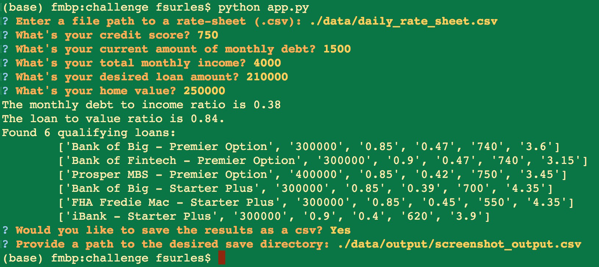

# ~~~ LLMM Mortgage Profiler ~~~

Welcome to the **02_Module Challenge** script!

>This ___new___, and ***improved*** version includes everything <u>___you___</u> need to handle loan applications for `<company_name>` leveraging the **BRAND NEW** and *cutting edge* ***CSV*** file-type.  
_'Need a loan to lean on???_  
_Call_ <u>Lean Loan Mortgage Management</u> (or <u>LLM</u> for short!) 
_to find out what you qualify for.. today!!!_

This script, when activated from the `challenge` parent folder by entering the command:
>`python app.py`

into the command line, and the interactive script will execute. 
_(at any time, you can press the key combination CTRL + C (control-c) to exit the script and return to the command line.)_

The primary purpose of this script is to take in a list of potential loan products in the form of a csv file and based upon the user's input will filter the list of loans to show only those loans which the user *passes base qualifications*.  
The aim is to provide a more automated experience to the mortgage banking officer in their day-to-day operations.

---

## Technologies

This `python` based script utilizes the modules found in 
> `requirements.txt`

---

## Installation Guide

for each module found in `requirements.txt`, run: 
> `pip install <module_name>=<version_number>`

replacing each `<module_name>` and `<version_number>` with their respective entries.

---

## Examples

example execution of the script:

---

## Usage

once the necessary files have been installed, and the script is called while the terminal is located in the parent directory `challenge`, with the command `python app.py`, the opportunity will be provided to save the script's generated output as a ***.csv*** file if the user inputs `Yes` during the appropriate prompt otherwise if the user inputs `No` the program will exit without saving the output data.

---

## Contributors

Forrest Surles

---

## License

Copyright 2021 - Forrest Surles

Permission is hereby granted, free of charge, to any person obtaining a copy of this software and associated documentation files (the "Software"), to deal in the Software without restriction, including without limitation the rights to use, copy, modify, merge, publish, distribute, sublicense, and/or sell copies of the Software, and to permit persons to whom the Software is furnished to do so, subject to the following conditions:

The above copyright notice and this permission notice shall be included in all copies or substantial portions of the Software.

THE SOFTWARE IS PROVIDED "AS IS", WITHOUT WARRANTY OF ANY KIND, EXPRESS OR IMPLIED, INCLUDING BUT NOT LIMITED TO THE WARRANTIES OF MERCHANTABILITY, FITNESS FOR A PARTICULAR PURPOSE AND NONINFRINGEMENT. IN NO EVENT SHALL THE AUTHORS OR COPYRIGHT HOLDERS BE LIABLE FOR ANY CLAIM, DAMAGES OR OTHER LIABILITY, WHETHER IN AN ACTION OF CONTRACT, TORT OR OTHERWISE, ARISING FROM, OUT OF OR IN CONNECTION WITH THE SOFTWARE OR THE USE OR OTHER DEALINGS IN THE SOFTWARE.